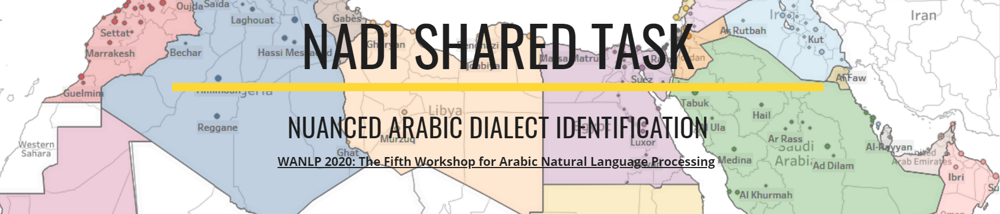
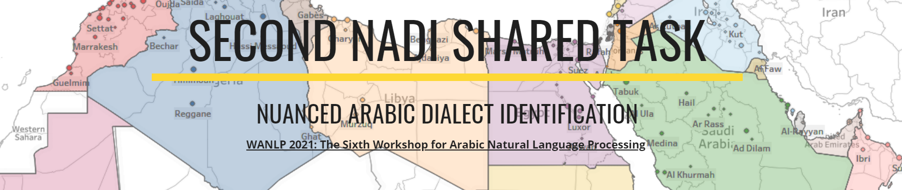

# Nuanced Arabic Dialect Identification Shared Task Series

This repository lists information relevant to the Nuanced Arabic Dialect Identification Shared Task Series.

<hr> 

# NADI 2020: The First Nuanced Arabic Dialect Identification Shared Task

We present the results and findings of the First Nuanced Arabic Dialect Identification Shared Task (NADI). 
This Shared Task includes two subtasks: country-level dialect identification (Subtask 1) and province-level sub-dialect identification (Subtask 2). 
The data for the shared task covers a total of 100 provinces from 21 Arab countries and are collected from the Twitter domain.  As such, NADI is the first shared task to target naturally-occurring fine-grained dialectal text at the sub-country level. 
A total of 61 teams from 25 countries registered to participate in the tasks, thus reflecting the interest of the community in this area. We received 47 submissions for Subtask 1 from 18 teams and 9 submissions for Subtask 2 from 9 teams. 

## Offical website
#### Access the offical website via [this](https://sites.google.com/view/nadi-shared-task) link.

## Sub-tasks
- **Subtask 1** Country-level dialect identification: A total of 21,000 tweets, covering all 21 Arab countries. This is a new dataset created for this shared task.
[CODALAB link](https://competitions.codalab.org/competitions/24001?secret_key=66d8a9d9-3ac9-4ef2-bb74-6b8f3e287468)
- **(2) Subtask 2** Province-level dialect identification. A total of 21,000 tweets, covering 100 provinces from all 21 Arab countries. This is the same dataset as in Subtask 1, but with province labels.
[CODALAB link](https://competitions.codalab.org/competitions/24002?secret_key=53f14ab8-7db2-4011-9418-c95ee3b7ea2c)

## Please cite NADI 2020 as follows:
```

@inproceedings{mageed:2020:nadi,
  title={{NADI 2020: The First Nuanced Arabic Dialect Identification Shared Task}},
  author={Abdul-Mageed, Muhammad and Zhang, Chiyu and Bouamor, Houda and Habash, Nizar},
  booktitle={Proceedings of the Fifth Arabic Natural Language Processing Workshop},
  pages={97--110},
  year={2020}
}

```
<hr> 
 


# NADI 2021: The Second Nuanced Arabic Dialect Identification Shared Task

We present the findings and results of the Second Nuanced Arabic Dialect Identification Shared Task (NADI 2021). 
This Shared Task includes four subtasks: country-level Modern Standard Arabic (MSA) identification (Subtask 1.1), country-level dialect identification (Subtask 1.2), province-level MSA identification (Subtask 2.1), and province-level sub-dialect identification (Subtask 2.2). The data for the shared task covers a total of 100 provinces from 21 Arab countries and are collected from the Twitter domain.  A total of 53 teams from 23 countries registered to participate in the tasks, thus reflecting the interest of the community in this area. We received 16 submissions for Subtask 1.1 from five teams, 27 submissions for Subtask 1.2 from eight teams, 12 submissions for Subtask 2.1 from four teams, and 13 Submissions for subtask 2.2 from four teams.

## Offical website
#### Access the offical website via [this](https://sites.google.com/view/second-nadi-shared-task) link.

## Sub-tasks
**(1) Subtask 1 (Country Level)**
- **Subtask 1.1:** Country-level MSA identification: A total of 21,000 tweets, covering 21 Arab countries. [CODALAB link](https://competitions.codalab.org/competitions/27768)
- **Subtask 1.2:** Country-level DA identification: A total of 21,000 tweets, covering 21 Arab countries. [CODALAB link](https://competitions.codalab.org/competitions/27769)

**(2) Subtask 2 (Province level)**
Similar to Subtask 1 but focusing on the 
- **Subtask 2.1:** Province-level MSA identification: A total of 21,000 tweets, covering 100 provinces. [CODALAB link](https://competitions.codalab.org/competitions/27770)
- **Subtask 2.2:** Province-level DA identification: A total of 21,000 tweets, covering 100 provinces. [CODALAB link](https://competitions.codalab.org/competitions/27771)


## Please cite NADI 2021 as follows:
```
@inproceedings{mageed:2021:nadi,
    author = {Abdul-Mageed, Muhammad and Zhang, Chiyu and Elmadany, AbdelRahim and Bouamor, Houda and Habash, Nizar}, 
    title = {{NADI 2021: The Second Nuanced Arabic Dialect Identification Shared Task}},
    booktitle ={Proceedings of the Sixth {A}rabic Natural Language Processing Workshop (WANLP 2021)},
    year = {2021},
}

```
